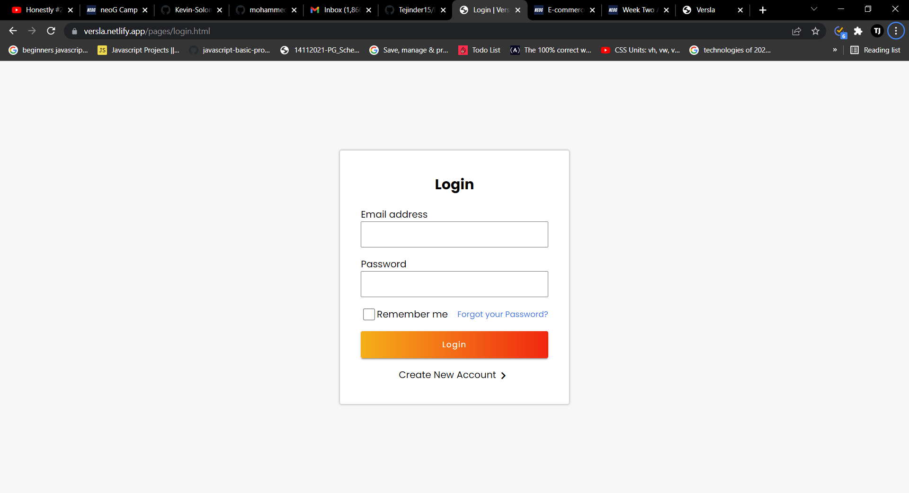
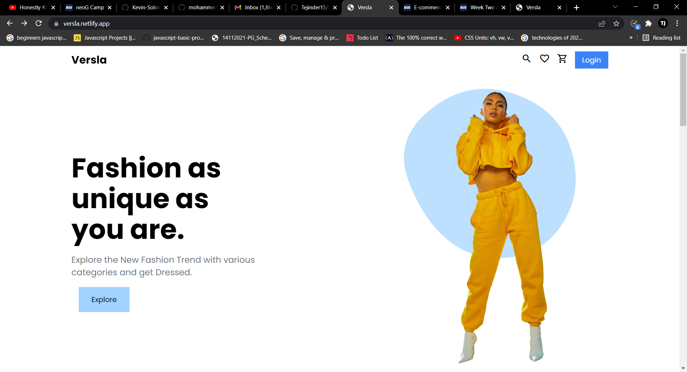
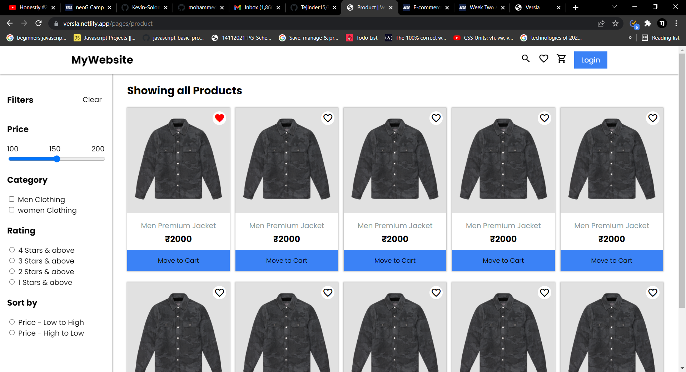
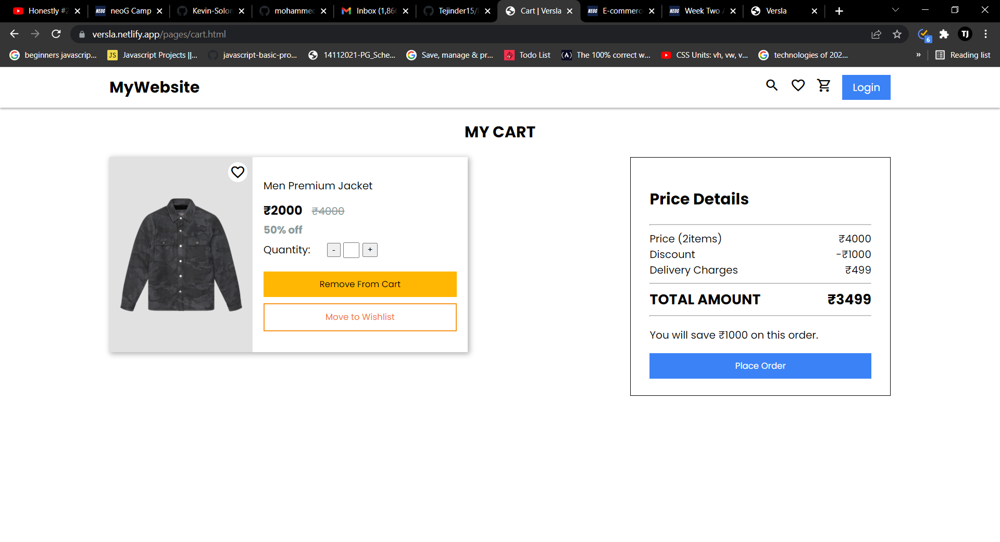
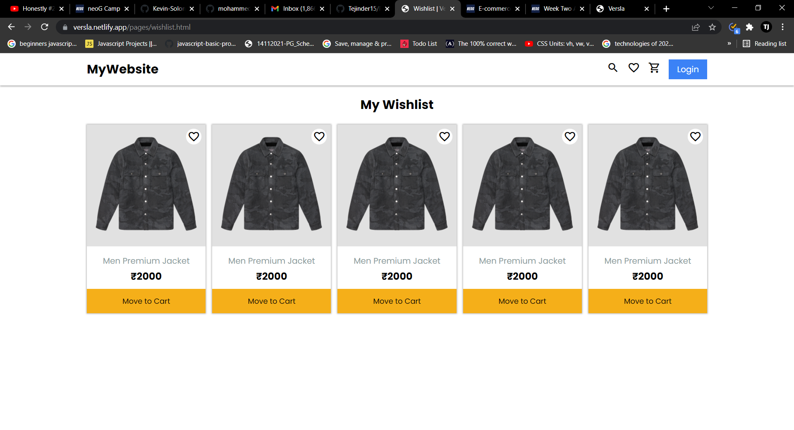

# Versla

Versla is an Ecommerce Website which deals in Clothes for Men and Women.

**This Repository contains the P0 Screens for Ecommerce Project.**

## Technologies Used

- HTML
- CSS
- PlumeUI component library

## Pages

- [Login](https://versla.netlify.app/pages/login)
- [Signup](https://versla.netlify.app/pages/signup.html)
- [Home](https://versla.netlify.app/)
- [Product](https://versla.netlify.app/pages/product)
- [Wishlist](https://versla.netlify.app/pages/wishlist.html)
- [Cart](https://versla.netlify.app/pages/cart.html)

## Screenshots

### Login

### Home

### Product

### Cart

### Wishlist

## Author

- Linkedin : [Tajinder](https://www.linkedin.com/in/tajinder-singh-2a0618221/)
